<p align="center">
  <a href="https://rafifdna.github.io/"></a>
  <h3 align="center">PAM-TRI</h3>
  <h3 align="center">Develop By  <a href="https://ugm.ac.id/id/"></a> Student</h3>
<hr>
<p align="center">
  <a href="https://www.gnu.org/licenses/gpl-3.0.html"></a>


## Overview

PAM-TRI is an Open Source Implementation of Privilege Access Management (PAM) base on [JumpServer](https://www.jumpserver.com/) with network integration from [Netbird](https://netbird.io/). 


It enhances features that jumpserver don't include in it's open source such as peer-to-peer connection with CGNAT endpoint, site-to-site connection to other vpc or router, and integration with single-sign-on from identity provider (OIDC, OAuth 2.0, SAML 2.0, Google, Github, Azure, and Apple).


It added features with Zero Trust from [Zitadel](https://zitadel.com/) for the peer-to-peer connection to the users. This solution specifically addresses the challenges of securing servers behind NAT that cannot be exposed publicly without port forwarding and expose the private resource using reverse proxy without compromise security when expose to the internet. 


Regular Users only got access to the terminal, nothing else.


## Architecture

```mermaid
flowchart LR
    %% Frontend Layer
    subgraph FrontendLayer["Frontend Layer"]
        direction TB
        Users{{"Users"}}
        JSUI["JumpServer Frontend"]
        Users --> JSUI
    end

    %% JumpServer Backend Layer
    subgraph JSBackend["JumpServer Backend"]
        direction LR
        Core["Core Service"]
        Chen["Chen Component"]
        Koko["Koko Component"]
        Lion["Lion Component"]
        
        Core --> Chen & Koko & Lion
    end

    %% Authentication Layer
    subgraph AuthLayer["Authentication Layer"]
        direction LR
        Zitadel["Zitadel IdP"]
        OIDC["OIDC"]
        OAuth["OAuth 2.0"]
        SAML["SAML 2.0"]
        
        OIDC & OAuth & SAML --> Zitadel
    end

    %% Network Layer
    subgraph NetworkLayer["Network Layer"]
        direction LR
        NB["Netbird"]
    end

    %% Protocol Layer
    subgraph ProtocolLayer["Protocol Layer"]
        direction LR
        COTURN["COTURN"]
        NAT["NAT Traversal"]
        
        COTURN --> NAT
    end

    %% Resources
    subgraph Resources["Protected Resources"]
        direction LR
        CGNAT["CGNAT Endpoints"]
        VPC["VPC"]
        Router["Router"]
    end

    %% Layer Connections
    FrontendLayer --> JSBackend
    JSBackend --> AuthLayer
    AuthLayer --> NetworkLayer
    NetworkLayer --> ProtocolLayer
    ProtocolLayer --> Resources
    
    %% Styling
    classDef default fill:#2D2D2D,stroke:#666,color:#fff,stroke-width:2px
    classDef layer fill:#1E1E1E,stroke:#666,color:#fff
    classDef endpoint fill:#2D2D2D,stroke:#666,color:#fff,stroke-width:2px
    
    class FrontendLayer,JSBackend,AuthLayer,NetworkLayer,ProtocolLayer,Resources layer
    class Users,CGNAT,VPC,Router endpoint
```




The system is built on a multi-layered architecture designed for security, scalability, and ease of use:

- Frontend Layer
    1. Provides the user interface through JumpServer's frontend
    2. Enables user interaction with the system
    3. Streamlined access to all functionality

- Backend Layer (JumpServer Enhanced)
    1. Core Service: Central management and orchestration
    2. Chen Component: Resource management
    3. Koko Component: Protocol handling
    4. Lion Component: System operations

- Authentication Layer
    1. Integrated with Zitadel Identity Provider
    2. Supports multiple authentication protocols:
        - OIDC (OpenID Connect)
        - OAuth 2.0
        - SAML 2.0
    3. Enhanced SSO capabilities

- Network Layer
    1. Leverages Netbird for secure networking
    2. Enables peer-to-peer connectivity

- Protocol Layer
    1. Utilizes COTURN for NAT traversal
    2. Facilitates direct connections through NAT
    3. Enables seamless connectivity


## How-to-deploy

There are two methods available for installing this stack. The Production Deployment method is recommended, as the Simple Deployment is intended only for staging or development environments.


### Prerequisites

- Latest [Docker Engine](https://docs.docker.com/engine/install/)
- Recommended Linux-based Operating System
- Recommended using two servers (Using one server might need to configure docker config manually) 
- Valid public domain with DNS pointed to it's server public IP for Netbird setup


### Simple Deployment

PAM-TRI offers a straightforward deployment process. By default, JumpServer is configured without SSL - you can manually enable it by modifying the config-example.txt file and configuring [Nginx](config_init/nginx) in the compose file with your certificate and public domain.

The deployment follows a comprehensive flow that integrates JumpServer with NetBird services, as illustrated in the diagram below:

```mermaid
flowchart LR
    %% External Users
    subgraph Internet
        ADMIN([Administrator])
        USER([User])
    end

    subgraph Server1[JumpServer Environment]
        direction TB
        subgraph JSStack[JumpServer Stack]
            JSWEB[Web UI/Terminal]
            JSCORE[Core Services]
            JSDB[(PostgreSQL)]
            JSRED[(Redis)]
            
            subgraph JSConn[Connection Services]
                KOKO[Koko - SSH]
                LION[Lion - Protocol]
                CHEN[Chen - Character]
            end
        end
        NBA1[NetBird Peer/Agent]
    end

    subgraph Server2[NetBird Control]
        direction TB
        subgraph NBStack[NetBird Services]
            CADDY[Caddy Proxy]
            ZIT[Zitadel IdP]
            NBDASH[Dashboard]
            ROLES[Access Control]
            
            subgraph NBCore[Core]
                MGT[Management]
                SIG[Signal]
                TURN[Coturn]
                RELAY[Relay]
                NBDB[(PostgreSQL)]
            end
        end
    end

    subgraph Server3[Lab Environment]
        direction TB
        NBA2[NetBird Peer/Agent]
        subgraph LabStack[Lab Services]
            DB[(MariaDB:3306)]
            VNC[VNC:5900]
            SSH[SSH:22]
        end
    end

    %% Regular User Flow
    USER -->|"Step 1 Access"| JSWEB
    JSWEB -->|"Step 2 Auth"| JSCORE
    JSCORE -->|"Step 3 Session"| JSRED
    JSCORE -->|"Step 4 User"| JSDB
    JSCORE -->|"Step 5 Connect"| JSConn
    JSConn -->|"Step 6 Auth"| NBA1
    
    NBA1 -->|"Step 7 Connect"| CADDY
    CADDY -->|"Step 8 Identity"| ZIT
    ZIT -->|"Step 9 Dashboard"| NBDASH
    NBDASH -->|"Step 10 Check"| ROLES
    ROLES -->|"Step 11 Policy"| MGT
    
    %% Access Control Flow
    MGT -->|"Step 12 Verify"| NBDB
    MGT -->|"Step 13 Allow"| SIG
    SIG -->|"Step 14 Setup"| TURN
    TURN -->|"Step 15 Relay"| RELAY
    
    RELAY -->|"Step 16 P2P"| NBA2
    NBA2 -->|"Step 17 Access"| LabStack

    %% Administrator Access Flow
    ADMIN -.->|"Admin Access"| JSWEB
    ADMIN -.->|"Admin Config"| NBDASH
    NBDASH -.->|"Set Rules"| ROLES
    ROLES -.->|"Store Policy"| NBDB

    %% Styling
    classDef client fill:#e1f8e9,stroke:#2e7d32,stroke-width:2px,color:black
    classDef admin fill:#b2dfdb,stroke:#004d40,stroke-width:2px,color:black
    classDef service fill:#f3e5f5,stroke:#6a1b9a,stroke-width:2px,color:black
    classDef db fill:#fff3e0,stroke:#e65100,stroke-width:2px,color:black
    classDef env fill:#f5f5f5,stroke:#616161,stroke-width:2px,color:black
    classDef proxy fill:#ffebee,stroke:#c62828,stroke-width:2px,color:black
    classDef peer fill:#81c784,stroke:#2e7d32,stroke-width:2px,color:black
    classDef idp fill:#fff9c4,stroke:#f57f17,stroke-width:2px,color:black

    %% Set all arrows to black with numbers
    linkStyle default stroke:black,stroke-width:2px

    class USER client
    class ADMIN admin
    class JSWEB,JSCORE,KOKO,LION,CHEN,MGT,SIG,TURN service
    class JSDB,JSRED,NBDB,DB db
    class CADDY proxy
    class NBA1,NBA2 peer
    class ZIT idp
```



#### Quick Start Guide

- Clone this repo

    ```
    git clone https://github.com/rafifdna/pam-tri.git
    ```

- Install Jumpserver

    ```
    # Go to the file directory
    cd pam-tri

    # Execute this bash command
    sudo bash start.sh
    ```

- Install Netbird

    ```
    # Execute this bash command
    sudo bash integration.sh
    ```


Done, all of the stack above will be installed. For more details about the full stack deployment using Cloudflare, you can continue to this [Deployment](#Production-Deployment) or refer to this [Blog](https://rafifdna.github.io/posts/pam-tri/).


### Production Deployment

For production deployment, you can use Nginx that are included in Jumpserver and make sure to config the public certificate to the nginx configuration.

To get the public certificate from your domain, you can use [acme.sh](https://github.com/acmesh-official/acme.sh) or [certbot](https://github.com/certbot/certbot).

For this deployment, it will integrates JumpServer with NetBird and Cloudflare Services, as illustrated in the diagram below:

```mermaid
flowchart LR
    %% External Users
    subgraph Internet
        ADMIN([Administrator])
        USER([User])
        
        subgraph Cloudflare[Cloudflare Services]
            direction TB
            CF_ACCESS[Access Service]
            CF_TUNNEL[Cloudflare Tunnel]
            CF_DNS[DNS]
        end
    end

    subgraph Server1[JumpServer Environment]
        direction TB
        CF_AGENT[Cloudflare Tunnel Agent]
        
        subgraph JSStack[JumpServer Stack]
            JSWEB[Web UI/Terminal]
            JSCORE[Core Services]
            JSDB[(PostgreSQL)]
            JSRED[(Redis)]
            
            subgraph JSConn[Connection Services]
                KOKO[Koko - SSH]
                LION[Lion - Protocol]
                CHEN[Chen - Character]
            end
        end
        NBA1[NetBird Peer/Agent]
    end

    subgraph Server2[NetBird Control]
        direction TB
        subgraph NBStack[NetBird Services]
            CADDY[Caddy Proxy]
            ZIT[Zitadel IdP]
            NBDASH[Dashboard]
            ROLES[Access Control]
            
            subgraph NBCore[Core]
                MGT[Management]
                SIG[Signal]
                TURN[Coturn]
                RELAY[Relay]
                NBDB[(PostgreSQL)]
            end
        end
    end

    subgraph Server3[Lab Environment]
        direction TB
        NBA2[NetBird Peer/Agent]
        subgraph LabStack[Lab Services]
            DB[(MariaDB:3306)]
            VNC[VNC:5900]
            SSH[SSH:22]
        end
    end

    %% Regular User Flow through Cloudflare
    USER -->|"Step 1 HTTPS Request"| CF_DNS
    CF_DNS -->|"Step 2 Route Traffic"| CF_ACCESS
    CF_ACCESS -->|"Step 3 Auth Check"| CF_TUNNEL
    CF_TUNNEL -->|"Step 4 Secure Tunnel"| CF_AGENT
    CF_AGENT -->|"Step 5 Forward"| JSWEB
    
    %% Rest of the flow remains similar
    JSWEB -->|"Step 6 Auth"| JSCORE
    JSCORE -->|"Step 7 Session"| JSRED
    JSCORE -->|"Step 8 User"| JSDB
    JSCORE -->|"Step 9 Connect"| JSConn
    JSConn -->|"Step 10 Auth"| NBA1
    
    NBA1 -->|"Step 11 Connect"| CADDY
    CADDY -->|"Step 12 Identity"| ZIT
    ZIT -->|"Step 13 Dashboard"| NBDASH
    NBDASH -->|"Step 14 Check"| ROLES
    ROLES -->|"Step 15 Policy"| MGT
    
    %% Access Control Flow
    MGT -->|"Step 16 Verify"| NBDB
    MGT -->|"Step 17 Allow"| SIG
    SIG -->|"Step 18 Setup"| TURN
    TURN -->|"Step 19 Relay"| RELAY
    
    RELAY -->|"Step 20 P2P"| NBA2
    NBA2 -->|"Step 21 Access"| LabStack

    %% Administrator Access Flow
    ADMIN -.->|"Admin Access"| CF_ACCESS
    CF_ACCESS -.->|"Auth"| CF_TUNNEL
    ADMIN -.->|"Admin Config"| NBDASH
    NBDASH -.->|"Set Rules"| ROLES
    ROLES -.->|"Store Policy"| NBDB

    %% Styling
    classDef client fill:#e1f8e9,stroke:#2e7d32,stroke-width:2px,color:black
    classDef admin fill:#b2dfdb,stroke:#004d40,stroke-width:2px,color:black
    classDef service fill:#f3e5f5,stroke:#6a1b9a,stroke-width:2px,color:black
    classDef db fill:#fff3e0,stroke:#e65100,stroke-width:2px,color:black
    classDef env fill:#f5f5f5,stroke:#616161,stroke-width:2px,color:black
    classDef proxy fill:#ffebee,stroke:#c62828,stroke-width:2px,color:black
    classDef peer fill:#81c784,stroke:#2e7d32,stroke-width:2px,color:black
    classDef idp fill:#fff9c4,stroke:#f57f17,stroke-width:2px,color:black
    classDef cf fill:#f0f4f8,stroke:#004d90,stroke-width:2px,color:black

    %% Apply Cloudflare styling
    class CF_ACCESS,CF_TUNNEL,CF_DNS,CF_AGENT cf
    
    %% Set all arrows to black with numbers
    linkStyle default stroke:black,stroke-width:2px

    class USER client
    class ADMIN admin
    class JSWEB,JSCORE,KOKO,LION,CHEN,MGT,SIG,TURN service
    class JSDB,JSRED,NBDB,DB db
    class CADDY proxy
    class NBA1,NBA2 peer
    class ZIT idp
```



#### Production Guide

This deployment utilizes Cloudflare's SaaS capabilities to enhance security for internal access within JumpServer. 

It leverages Cloudflare's reverse proxy through cloudflared and implements Cloudflare Access as the identity access management solution for user authentication within JumpServer. 

For more guide about the production deployment refer to this [Blog](https://rafifdna.github.io/posts/pam-tri/).


## License

This project is licensed under the GNU General Public License v3.0 - see the [LICENSE](LICENSE) file for details.


## Authors

Developed by students at [Universitas Gadjah Mada (UGM)](https://ugm.ac.id/id/).


## Next Plan

PAM-TRI is built on an open-source stack that includes JumpServer, NetBird, and other tools. However, some JumpServer integrations, such as reverse proxy and identity provider, currently rely on Cloudflare's SaaS solutions.

You can use Cloudflare's free plan for this project, so there's no need to spend money on the stack.

In version 2, I plan to mature the project by:
- Eliminating the dependency on Cloudflare SaaS solutions for JumpServer integration and migrating entirely to open-source 
- Integrating all components into a single Docker container file for users who prefer a simpler approach
- Adding Kubernetes support

Thank you for supporting my project!